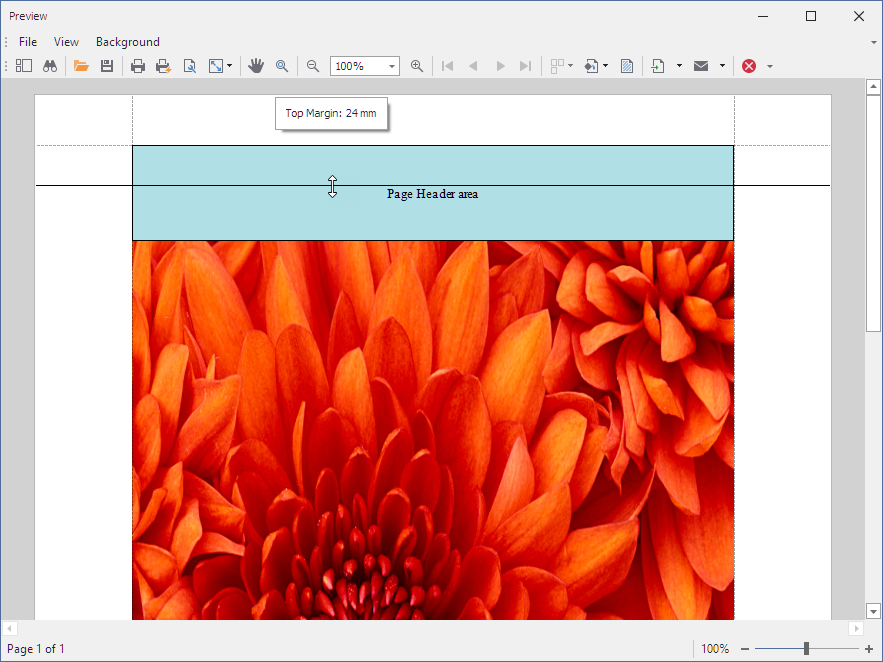

<!-- default badges list -->

<!-- default badges end -->
# Reporting for WinForms - How to Dynamically Size an Image to Fit the Entire Page Client Area

This example shows how to dynamically resize the [XRPictureBox](https://docs.devexpress.com/XtraReports/DevExpress.XtraReports.UI.XRPictureBox) control so that it occupies the entire client area when the end user resizes margins or changes page settings.

## Files to Review

* [Form1.cs](CS/WindowsFormsApplication1/Form1.cs) (VB: [Form1.vb](VB/WindowsFormsApplication1/Form1.vb))
* [Program.cs](CS/WindowsFormsApplication1/Program.cs) (VB: [Program.vb](VB/WindowsFormsApplication1/Program.vb))
* [XtraReport1.cs](CS/WindowsFormsApplication1/XtraReport1.cs) (VB: [XtraReport1.vb](VB/WindowsFormsApplication1/XtraReport1.vb))

## Documentation

- [PreviewOptions.SyncWithReportPageSettings](https://docs.devexpress.com/XtraReports/DevExpress.XtraReports.Configuration.PreviewOptions.SyncWithReportPageSettings)
- [XRControl.AnchorHorizontal](https://docs.devexpress.com/XtraReports/DevExpress.XtraReports.UI.XRControl.AnchorHorizontal)
- [DevExpress Reports: Responsive Report Layouts with Control Anchoring in Print Preview](https://www.youtube.com/watch?v=BTova7md3BY)
## More Examples

- [How to anchor controls to the top-right side when document margins are changed in the Print Preview](https://github.com/DevExpress-Examples/Reporting_how-to-anchor-controls-to-the-top-right-side-when-document-margins-are-changed-in-the-e632)
<!-- feedback -->
## Does this example address your development requirements/objectives?

 

(you will be redirected to DevExpress.com to submit your response)
<!-- feedback end -->
